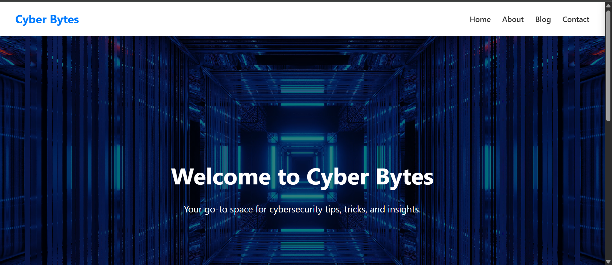

# Cyber Bytes 🛡️

**Cyber Bytes** is a clean, modern, beginner-friendly cybersecurity blog built with HTML, CSS, and a touch of JavaScript. It’s designed to make complex cybersecurity topics simple and accessible to everyone—from curious beginners to tech enthusiasts.

 

## 🌐 Live Demo

🔗 [Visit Cyber Bytes](https://stephwinam.github.io/Cybersecurity-Bytes-Blog)


---

## 📖 Features

- ✅ **Sticky, responsive navigation bar** on every page
- ✅ **Home page** with a hero section and recent blog posts
- ✅ **Blog page** with all posts and individual article pages
- ✅ **"Continue Reading"** buttons that lead to full blog content
- ✅ **Contact page** with a styled form for user messages
- ✅ **About page** describing the purpose and creator of the blog
- ✅ Mobile-friendly and visually appealing design
- ✅ Clean and semantic HTML5 structure
- ✅ Easy to extend and customize

---

## 🛠️ Built With

- HTML5  
- CSS3  
- JavaScript (for minor interactivity)

---

## 🚀 How to Use or Contribute

 **Clone the repository:**

```bash
git clone https://github.com/stephwinam/Cybersecurity-Bytes-Blog.git
cd Cybersecurity-Bytes-Blog

Open in a browser:

Just open index.html in your browser.

Want to contribute?

Feel free to fork this repo, make your changes, and submit a pull request!

